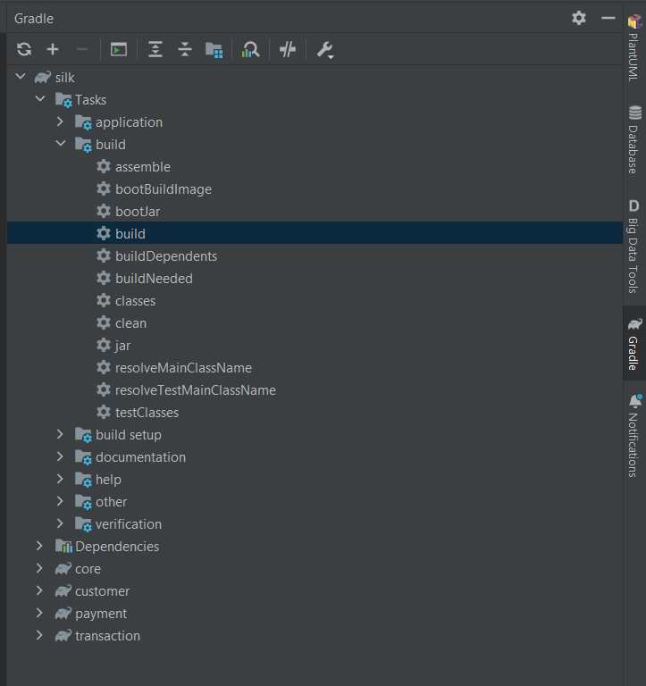
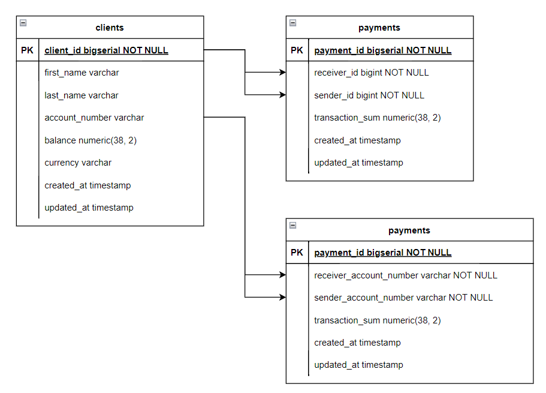
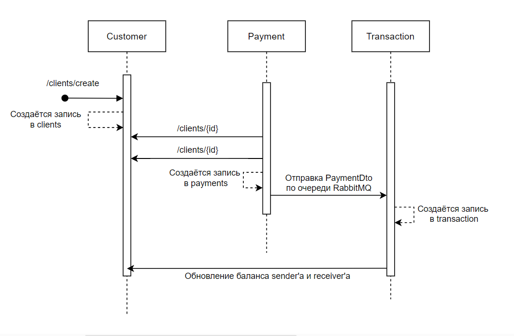

# SILK-PAYMENT

# Установка
### Для проекта использовалась Java 17, сборка на gradle
### В settings.gradle в корневой директории включены все микросервисы. Перед запуском нужно провести сборку проекта

### Порядок запуска микросервисов: customer > payment > transaction
### В проекте так же использовался docker-compose с образами PostgreSQL и RabbitMQ

`docker-compose up`

---

# Технологии
* Spring Boot 3.1.1 
* Docker 
* RabbitMQ 
* Lombok 
* FeignClient
* FlywayMigration
* Hibernate

### Данный проект содержит в себе 3 микросервиса и 1 core модуль, который содержит в себе классы и интерфейсы, используемые в микросервисах

---
# Список микросервисов:
### 1. Customer - сервис, отвечающий за создание клиентов
### 2. Payment - сервис, который собирает платеж и данные о клиентах через FeignClient и отправляет их по очереди RabbitMQ в микросервис Transaction
### 3. Transaction - сервис, который принимает DTO платежа через очередь RabbitMQ и проводит операцию по переводу денег

## UML диаграма

---
## Sequence diagram

---
## Так же прикрепляю в корневой директории проекта список запросов в Postman
